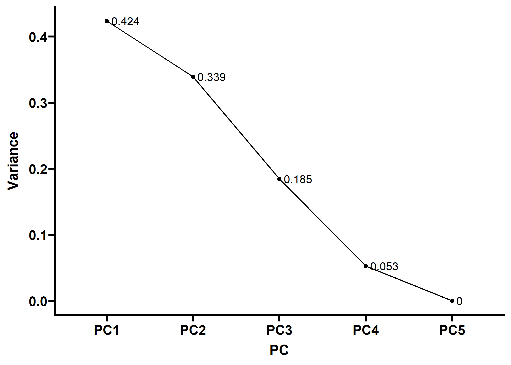
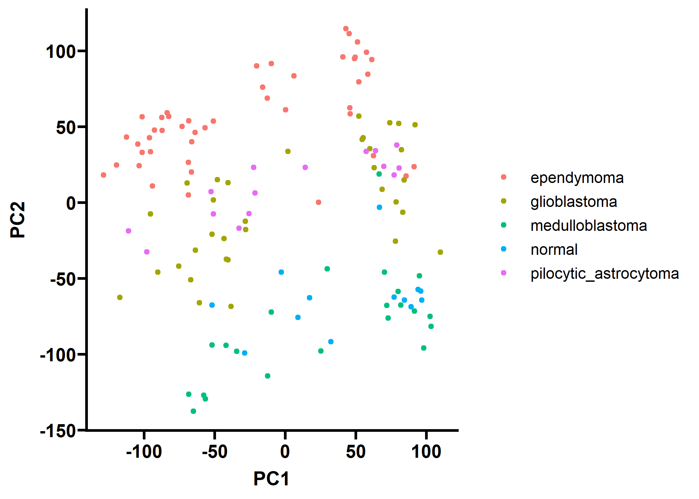
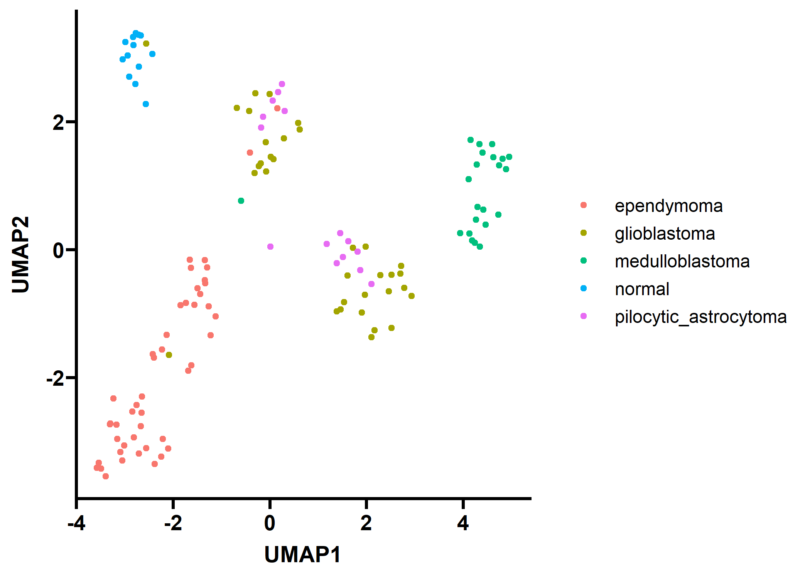

Understanding the molecular phenotype of astrocytoma progression
================
Roshan Lodha
07 February, 2022


``` r
knitr::opts_chunk$set(
  cache = FALSE, # if TRUE knitr will cache results to reuse in future knits
  #fig.width = 6, # the width for plots created by code chunk
  #fig.height = 4.5, # the height for plots created by code chunk
  out.width = "80%", 
  out.height = "80%",
  fig.align = 'center', # how to align graphics. 'left', 'right', 'center'
  dpi = 300, 
  dev = 'png',
  # results = 'asis', # knitr passes through results without reformatting
  echo = TRUE, # if FALSE knitr won't display code in chunk above it's results
  message = TRUE, # if FALSE knitr won't display messages generated by code
  strip.white = TRUE, # if FALSE knitr won't remove white spaces at beg or end
  warning = FALSE) # if FALSE knitr won't display warning messages in the doc

#Add packages
library(tidyverse)
```

    ## -- Attaching packages --------------------------------------- tidyverse 1.3.1 --

    ## v ggplot2 3.3.5     v purrr   0.3.4
    ## v tibble  3.1.6     v dplyr   1.0.7
    ## v tidyr   1.2.0     v stringr 1.4.0
    ## v readr   2.1.2     v forcats 0.5.1

    ## -- Conflicts ------------------------------------------ tidyverse_conflicts() --
    ## x dplyr::filter() masks stats::filter()
    ## x dplyr::lag()    masks stats::lag()

``` r
library(ggprism) #theme
library(umap) #for later use
library(Rtsne) #for later use
library(ggpubr) #theme

#Set universal them for figures
theme_set(ggprism::theme_prism()) #using GraphPad Prism based theme from ggprism package
```

-   The dataset I have chosen to work with this semester is the GSE50161
    dataset from the paper “Expression data from human brain tumors and
    human normal brain” from Griesinger et. al. The original dataset can
    be found here:
    <https://www.ncbi.nlm.nih.gov/geo/query/acc.cgi?acc=GSE50161>. The
    processed data can be found here:
    <https://www.kaggle.com/brunogrisci/brain-cancer-gene-expression-cumida>.
-   For this dataset, my primary question is whether or not we can
    determine the subtype of astrocytoma (a form of brain cancer) using
    gene expression data (Supervised Learning). The binary subquestion
    will be to simply determine malignancy through the expression data.
    The second question I would like to ask is how well the phenotype
    correlates with the genotype (Unsupervised Learning), and what genes
    are primarily responsible for the phenotypic variance. For this
    problem, this means assessing the distance between a sample and its
    cluster.
-   The dataset is a wide matrix, with over 50,000 variables for just
    130 samples. This poses an interesting challenge for machine
    learning, and I will likely have to first learn then apply
    regularization or dimensional reduction to prevent overfitting. Each
    row is the gene expression of profile of sample of human cells that
    has 1 of 5 labels corresponding to the grade and presence of
    astrocytoma (Grades I –> Grade IV or normal). Each column represents
    the (normalized) expression of each gene.
-   The outcome of the project is to hopefully develop a tool that can
    categorize the severity of an astrocytoma based on its gene
    expression profile.

# Excuetive Summary

-   Summarize the key (This could be a bulleted list)
    -   information about your data set
    -   major data cleaning
    -   findings from EDA
    -   Model output
    -   Overall conclusions “Expression data from human brain tumors and
        human normal brain” from Griesinger et. al. 

# Abstract

-   Summary of the nature, finding and meaning of your data analysis
    project.
-   1 paragraph written summary of your data analysis project

# Introduction

OUTLINE: \* astrocytoma background \* data from which paper \* variable
discussion \* potential use cases of these models (e.g. autodiagnosis)
\* how to improve model

# Data Science Methods

Broadly, data analysis will focus on dimensionality reduction and
clustering of samples in order to establish boundaries between
astrocytoma subtypes. This will be done using `PCA`, `tSNE`, and `UMAP`.
PCA of the subtype averages will also be used to tease out genes that
are the most significant contributors to astrocytoma progression.
Subsequently, classification will be performed in several different
manners. Logistic regression of dimensionally reduced data can be used
to determine if a patient does or does not have cancer. `KNN` or
`random forest` can we used to draw visualizable decision boundaries and
to determine the similarities between different subtypes (there is
currently significant debate on the categorization of astrocytoma based
on histology alone). Finally, a `neural network` will be used to create
a rudamentary classifier.

# Exploratory Data Analysis

## Explanation of your data set

The brain cancer GSE dataset is derived from the paper “Expression data
from human brain tumors and human normal brain” by Griesinger et.
al. The data was pre-processed to convert the raw expression read data
into gene set enrichment (GSE) data using command-line tools to be used
for downstream bioinformatics applications. After processing, the data
was made available on Kaggle. Each row of the dataset corresponds to a
single sample, or a single brain tumor specimen, and its RNA-expression
data. Each column corresponds to a specific transcript, that maps to a
region of the genome. For example, the first transcript, 1007_s\_at,
maps to the gene Discoidin Domain Receptor Tyrosine Kinase 1 (DDR1). The
transcripts code refers to the gene’s Affymetrix Probe ID, with
Affymetrix being the company conducting the sequencing. The overall
dimensions of the dataset include 130 specimen, each with expression
data for 54,613 genes. Each expression value, and hence each cell, is
numeric, with the exception of the “type” column, which denotes the type
of astrocytoma. Astrocytoma is an aggresive cancer that originates in
the astrocytes in the brain, and is generally graded on a scale of 0 to
4, with 0 being control (no astrocytoma). Thus each sample is one of 5
types. These assignments were made using histology of the biopsied
tissue.

``` r
brain_cancer_GSE <- read_csv("./Brain_GSE50161.csv") # load in data
```

    ## Rows: 130 Columns: 54677
    ## -- Column specification --------------------------------------------------------
    ## Delimiter: ","
    ## chr     (1): type
    ## dbl (54676): samples, 1007_s_at, 1053_at, 117_at, 121_at, 1255_g_at, 1294_at...
    ## 
    ## i Use `spec()` to retrieve the full column specification for this data.
    ## i Specify the column types or set `show_col_types = FALSE` to quiet this message.

``` r
type <- brain_cancer_GSE[ , "type"] # isolate the data label
gene_expr <- brain_cancer_GSE %>% 
  dplyr::select(where(is.numeric)) %>% # only select gene expression data
  column_to_rownames("samples")

head(gene_expr[1:8]) # displays just the first 8 transcripts of just the first 5 samples
```

    ##     1007_s_at  1053_at    117_at   121_at 1255_g_at  1294_at  1316_at  1320_at
    ## 834  12.49815 7.604868  6.880934 9.027128  4.176175 7.224920 6.085942 6.835999
    ## 835  13.06744 7.998090  7.209076 9.723322  4.826126 7.539381 6.250962 8.012549
    ## 836  13.06818 8.573674  8.647684 9.613002  4.396581 7.813101 6.007746 7.178156
    ## 837  12.45604 9.098977  6.628784 8.517677  4.154847 8.361843 6.596064 6.347285
    ## 838  12.69996 8.800721 11.556188 9.166309  4.165891 7.923826 6.212754 6.866387
    ## 839  12.46109 7.676462  7.244519 9.676867  3.904301 7.467139 6.585188 7.061578

## Data Cleaning

As aforementioned, the nature of the data mitigated the need for
extensive data cleaning. However, AFFY control and background control
probes needed to be removed, as they were used to determine the quality
and depth of the sequencing and would artificially skew the data as they
would be detected equally in each subtype of brain cancer.

``` r
gene_expr <- gene_expr %>% 
  select(-contains("AFFX-")) %>% #removing affy control probes
  select(-contains("BGP-")) #removes background control probes 

head(gene_expr[1:8]) ## displays just the first 8 transcripts of just the first 5 samples
```

    ##     1007_s_at  1053_at    117_at   121_at 1255_g_at  1294_at  1316_at  1320_at
    ## 834  12.49815 7.604868  6.880934 9.027128  4.176175 7.224920 6.085942 6.835999
    ## 835  13.06744 7.998090  7.209076 9.723322  4.826126 7.539381 6.250962 8.012549
    ## 836  13.06818 8.573674  8.647684 9.613002  4.396581 7.813101 6.007746 7.178156
    ## 837  12.45604 9.098977  6.628784 8.517677  4.154847 8.361843 6.596064 6.347285
    ## 838  12.69996 8.800721 11.556188 9.166309  4.165891 7.923826 6.212754 6.866387
    ## 839  12.46109 7.676462  7.244519 9.676867  3.904301 7.467139 6.585188 7.061578

## Data Vizualizations

## Variable Correlations

As the underlying question sought to distinguish cancer type via gene
expression data, the gene expression across the 5 types were first
averaged before PCA was done to reduce dimensionality. Interestingly,
the model found that the 5th principal component was a linear
combination of the first 4 (contributed to no variance), indicating that
there may only be 3 distinct subtypes of astrocytoma and one normal
based on this data. Data was not scaled to preserve within-sample
relative distributions but was centered.

``` r
gene_expr_mean <- cbind(type, gene_expr) %>%
  group_by(type) %>%
  summarise(across(everything(), mean))
means_pca_fit <- prcomp(gene_expr_mean %>% 
                          dplyr::select(where(is.numeric)), 
                        center = TRUE, 
                        scale = FALSE)
var_explained_df <- data.frame(PC = paste0("PC", 1:length(means_pca_fit$sdev)),
                               Variance = (means_pca_fit$sdev)^2/sum((means_pca_fit$sdev)^2))
var_explained_df$label <- round(var_explained_df$Variance, 3)

means_pca_plot <- ggplot(data = var_explained_df, aes(x = PC,y = Variance, group = 1, label = label)) +
  geom_point() + 
  geom_line() + 
  geom_text(hjust = 0, nudge_x = 0.05)

ggsave(file="./figures/means_pca.svg", plot = means_pca_plot)
```

    ## Saving 7 x 5 in image

``` r
means_pca_plot
```



Following PCA, the top 5 contributing genes to astrocytoma
differentiation were assessed by looking at the first 5 entries of
principal component 1. These 5 AFFY codes were cross-referenced on the
internet to find the genes most important to progression of astrocytoma.

``` r
pc1 <- data.frame(means_pca_fit$rotation[, 1]) %>% 
  arrange(desc(means_pca_fit.rotation...1.))
top5 <- head(pc1, 5)
top5$gene <- c("GABRG2", "STMN2", "MYT1L", "NEFL", "MAP4")
top5
```

    ##             means_pca_fit.rotation...1.   gene
    ## 1568612_at                   0.04270127 GABRG2
    ## 221805_at                    0.04122958  STMN2
    ## 210016_at                    0.03782503  MYT1L
    ## 203001_s_at                  0.03777425   NEFL
    ## 235066_at                    0.03675190   MAP4

The first gene, Gamma-Aminobutyric Acid Type A Receptor Subunit Gamma2
(GABRG2), is a receptor for a major neurotransmitter known as GABA,
indicating that there are in fact neuronal changes driving astrocytoma
progression (or vice versa). Of the other genes both Myelin
Transcription Factor 1 Like (MYT1L) and Neurofilament light polypeptide
(NEFL) are specific to the brain, further indicating that
neuron-specific changes in astrocytoma.

Now, we can try clustering the data using various algorithms to see how
seperable the data is.

``` r
pca_fit <- prcomp(as.matrix(gene_expr))
pca_df <- data.frame(PC1 = pca_fit$x[,1], #1st PC
                     PC2 = pca_fit$x[,2], #2nd PC
                     type = type)

pca_plot <- ggplot(pca_df, aes(PC1, PC2, colour = type)) + 
  geom_point()
ggsave(file="./figures/pca.svg", plot = pca_plot, height = 7, width = 10)
pca_plot
```


PCA produces awful results, with little to no clustering by cancer
subtype. This is common of gene set enrichment datasets, and thus
advances techniques like tSNE and UMAP were developed to improve
clustering accuracy.

``` r
umap_fit <- umap(gene_expr)
umap_df <- data.frame(UMAP1 = umap_fit$layout[,1], #1st UMAP dimension
                      UMAP2 = umap_fit$layout[,2], #2nd UMAP dimension
                      type = type)

umap_plot <- ggplot(umap_df, aes(UMAP1, UMAP2, colour = type)) +
  geom_point()

ggsave(file="./figures/umap.svg", plot = umap_plot, height = 7, width = 10)
umap_plot
```


From the UMAP plot, we can clearly see much better separability, with
the normal cells, medulloblastoma tumors, and ependymoma tumors (mostly)
forming their own clusters. Additionally, it seems as though pilocytic
astrocytomas are genetically similar to glioblastomas. # Statistical
Learning: Modeling & Prediction

-   DSCI 451 will accomplish at least 1 simple linear model (or simple
    logistic model)

-   DSCI 352/352M/452 requires the appropriate modeling for your data
    set including machine learning

-   Types of modeling to try

-   Statistical prediction/modeling

-   Model selection

-   Cross-validation, Predictive R2

-   Interpret results

-   Challenge results

# Discussion

-   Discussion of the answers to the data science questions framed in
    the introduction

# Conclusions

# Acknowledgments

# References

-   Include a bib file in the markdown report
-   Or hand written citations.
